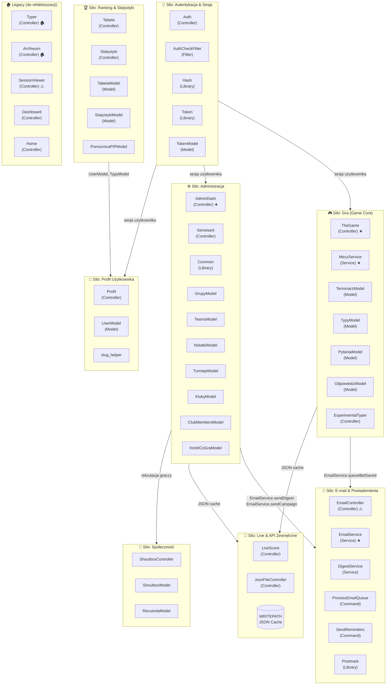
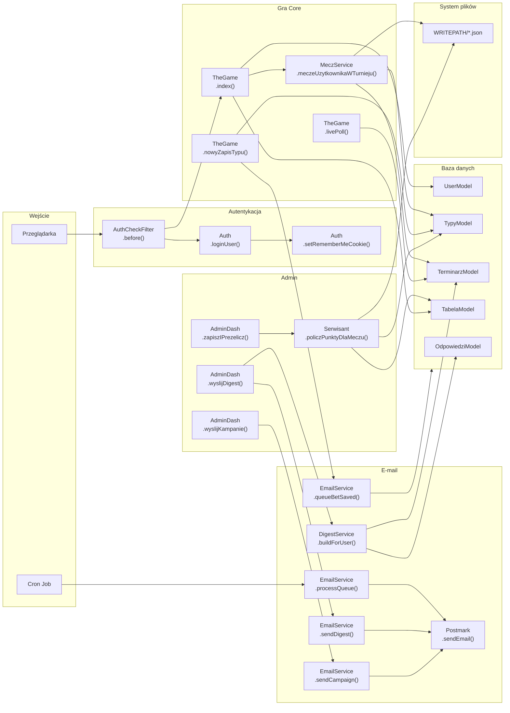
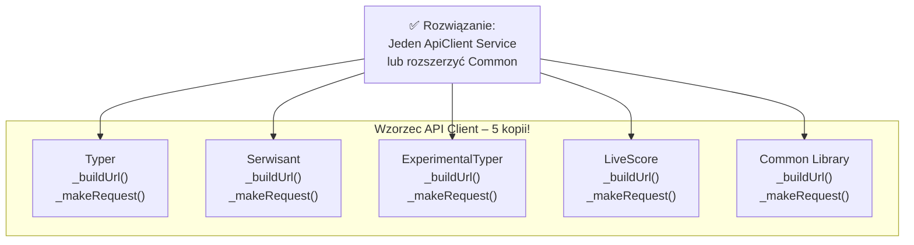

# TheGameApp – Audyt kodu: metody, wywołania, silosy

> Wygenerowano: 2026-06-20 | Gałąź: `claude/plantuml-staging-code-dq4kn5`

---

## Legenda statusów

| Symbol | Znaczenie |
|---|---|
| ✅ | Metoda aktywna, wywoływana |
| 🔧 | Metoda zdefiniowana, ale **nie wywoływana** z innych klas (potencjalny dead code) |
| ⬜ | Metoda **pusta** (stub / no-op) |
| ♻️ | Metoda **zduplikowana** w innym miejscu |
| 🏚️ | Kod **legacy** (superseded przez nowszy komponent) |
| ⚠️ | Metoda wymaga uwagi (niepełna, debug, hardcoded) |

---

## Mapa silosów domenowych

---

## Silo 1 – Autentykacja & Sesja

### `Auth` (Controller)

| Metoda | Widoczność | Status | Wywołuje |
|---|---|---|---|
| `__construct()` | public | ✅ | url_helper, form_helper |
| `index()` | public | ✅ | → view auth/login |
| `reset()` | public | ✅ | → view auth/reset |
| `resetPassword()` | public | ✅ | UserModel, Postmark |
| `register()` | public | ✅ | → view auth/register |
| `registerUser()` | public | ✅ | UserModel, Hash, Postmark |
| `confirm($token)` | public | ✅ | TokenModel, UserModel |
| `loginUser()` | public | ✅ | UserModel, Hash, setRememberMeCookie |
| `logout()` | public | ✅ | TokenModel |
| `newPassStart($token)` | public | ✅ | TokenModel |
| `newPassSave()` | public | ✅ | UserModel, Hash, Postmark |
| `setRememberMeCookie($userUniId, $userAgent)` | public | ✅ | TokenModel |

### `AuthCheckFilter` (Filter)

| Metoda | Status | Opis |
|---|---|---|
| `before()` | ✅ | Sprawdza sesję lub cookie remember_me → `restoreSession()` lub redirect |
| `restoreSession()` | ✅ | Odtwarza sesję z tokenem remember_me |
| `after()` | ⬜ | **Puste no-op** – możliwe do usunięcia |

### `Hash` / `Token` (Libraries)

| Klasa | Metoda | Status | Uwagi |
|---|---|---|---|
| Hash | `encrypt($password)` | ✅ | bcrypt |
| Hash | `check($userPassword, $dbPassword)` | ✅ | weryfikacja hasła |
| Token | `createToken($forID, $reason)` | ✅ | token 24h, zapis do DB |
| Token | `check()` | 🔧 | **Nigdy nie wywoływana** – duplikat Hash::check |

---

## Silo 2 – Gra (Game Core)

### `TheGame` (Controller) ★ aktywny core

| Metoda | Status | Wywołuje | Wywołujący |
|---|---|---|---|
| `__construct()` | ✅ | MeczService, modele | Router |
| `index($turniejID)` | ✅ | MeczService, TabelaModel, UserModel | Router |
| `testIndex($turniejID)` | ✅ | MeczService, TypyModel, batch queries | Router |
| `livePoll()` | ✅ | TerminarzModel (AJAX) | JS frontend |
| `akordeon($turniejID)` | ✅ | MeczService | Router |
| `wszystkieMecze($turniejID)` | ✅ | MeczService | Router |
| `archiwum($turniejID)` | ✅ | MeczService, JSON cache | Router |
| `dejCookie()` | ⚠️ | `$_COOKIE` dump | **DEBUG – do usunięcia** |
| `nowyZapisTypu()` | ✅ | TypyModel (AJAX) | JS frontend |
| `zapiszOdpowiedzNaPytanie()` | ✅ | OdpowiedziModel (AJAX) | JS frontend |
| `wygenerujOdpowiedziNaPytanie($pytanieID)` | ✅ | OdpowiedziModel → JSON | Router |
| `archiwumPytan($turniejID)` | ✅ | PytaniaModel, OdpowiedziModel | Router |
| `pokazZasady()` | ✅ ♻️ | → view | **Duplikat w Typer** |

### `MeczService` (Service) ★

| Metoda | Status | Wywołujący |
|---|---|---|
| `__construct()` | ✅ | TheGame |
| `meczeUzytkownikaWTurnieju()` | ✅ | TheGame (3×) |
| `getMeczeTurnieju()` | ✅ | meczeUzytkownikaWTurnieju |
| `getMeczeTurniejuDoRozegrania()` | ✅ | meczeUzytkownikaWTurnieju |
| `getRozegraneMeczeTurnieju()` | ✅ | meczeUzytkownikaWTurnieju |
| `getMeczeDnia()` | ✅ | meczeUzytkownikaWTurnieju |
| `manageJsonFiles()` | ✅ | meczeUzytkownikaWTurnieju → WRITEPATH |
| `getUserTypesForMatches()` | ✅ | meczeUzytkownikaWTurnieju |
| `odswiezLiveMecze()` | 🔧 | **Brak wywołania z kontrolera** |

### `ExperimentalTyper` (Controller)

| Metoda | Status | Uwagi |
|---|---|---|
| `__construct()` | ✅ | |
| `_buildUrl()` | ✅ ♻️ | **Duplikat** w Typer, Serwisant, LiveScore, Common |
| `_makeRequest()` | ✅ ♻️ | **Duplikat** – j.w. |
| `getLivescores()` | ✅ ♻️ | Duplikat w Typer, LiveScore |
| `getFixtures()` | ✅ ♻️ | Duplikat |
| `getScorers()` | ✅ | Tylko tu |
| `getEvents()` | ✅ ♻️ | Duplikat |
| `meczNaZywo(int $mecz)` | ✅ | |
| `getHTH()` | ✅ ♻️ | Duplikat w Typer, LiveScore |
| `wyswietlMeczExpanded()` | ✅ ♻️ | Duplikat w Typer |
| `preMecz()` | ✅ ♻️ | **Duplikat** w Typer, LiveScore |
| `pokazTypyGraczy(int $mecz)` | ✅ ♻️ | Duplikat w Typer |
| `coMowiaBookmacherzy(int $mecz)` | ⚠️ | **DEBUG – dump odds, do usunięcia** |
| `theGame()` | ✅ | |
| `mojePunkty()` | ✅ | |
| `pokazStrzelcow($rozgrywki)` | ✅ | |
| `tabelaTylkoMecze()` | ✅ | |
| `tabelaTylkoPytania()` | ✅ | |
| `ileDokladnychWynikow()` | ✅ | |

### Modele game core

| Model | Metoda | Status | Wywołujący |
|---|---|---|---|
| TerminarzModel | `getMeczById()` | ✅ | TheGame, Serwisant, MeczService |
| TerminarzModel | `getMeczeByTurniejId()` | ✅ | MeczService, AdminDash |
| TerminarzModel | `zapiszLubAktualizujMecze()` | ✅ | AdminDash, Serwisant |
| TerminarzModel | `getRozpoczeteNieZakonczone()` | ✅ | TheGame::livePoll |
| TerminarzModel | `czyRozpoczety()` | ✅ | TheGame::nowyZapisTypu |
| TerminarzModel | `getMecze24h()` | ✅ | MeczService |
| TypyModel | `zapiszTyp()` | ✅ | TheGame |
| TypyModel | `getTypyByMeczId()` | ✅ | TheGame, Serwisant |
| TypyModel | `usedGoldenBall()` | ✅ | TheGame |
| TypyModel | `removeGoldenGame()` | ✅ | TheGame (2×) |
| TypyModel | `canSaveTyp()` | ✅ | TheGame |
| TypyModel | `punktyZaMecze()` | ✅ | Profil, Tabela |
| TypyModel | `dokladneTrafienia()` | ✅ | Profil, Tabela |
| PytaniaModel | `addQuestion()` | ✅ | AdminDash |
| PytaniaModel | `getPytanieByTurniejID()` | ✅ | TheGame, AdminDash |
| PytaniaModel | `getActiveQuestions()` | ✅ | TheGame |
| PytaniaModel | `getQuestionsArchive()` | ✅ | TheGame |
| OdpowiedziModel | `saveAnswer()` | ✅ | TheGame |
| OdpowiedziModel | `punktyZaPytania()` | ✅ | Profil, Tabela |
| OdpowiedziModel | `liczbaOdpowiedziNaPytanie()` | ✅ | TheGame |
| OdpowiedziModel | `pobierzOdpowiedziNaPytanie()` | ✅ | TheGame, AdminDash |

---

## Silo 3 – Administracja

### `AdminDash` (Controller) ★

| Metoda | Status | Uwagi |
|---|---|---|
| `__construct()` | ✅ | |
| `loadTournaments()` | ✅ | Wewnętrzne |
| `dodajTurniej()` | ✅ | |
| `zmienAktywnyTurniej()` | ✅ | Aktualizuje JSON + flagi użytkowników |
| `zapiszMeczeTurnieju($iD, $localId, $page)` | ✅ ♻️ | Duplikat w Serwisant |
| `custom_log($message)` | ✅ ♻️ | Używane lokalnie; duplikat wzorca w LiveScore |
| `loadClubs()` | ✅ | |
| `dodajKlub()` | ✅ | |
| `dodajPytanie()` | ✅ ♻️ | Duplikat w Serwisant::dodajPytanie (legacy) |
| `getTourmanentQuestions()` | ✅ | |
| `updateQuestionStatus()` | ✅ | |
| `dodajNotatke()` | ✅ | |
| `ukryjNotatke(int $id)` | ✅ | |
| `assignUserToClub()` | ✅ | |
| `assignUserToClubView()` | ✅ | |
| `removeUserFromClub()` | ✅ | |
| `index()` | ✅ | |
| `mecze()` | ✅ | |
| `_pobierzHistoryIndex()` | ✅ | Prywatna, wywołana z mecze() |
| `pytania()` | ✅ | |
| `odpowiedziNaPytanie(int $id)` | ✅ | |
| `zapiszPunktyOdpowiedzi()` | ✅ | |
| `gracze()` | ✅ | |
| `turnieje()` | ✅ | |
| `kampanie()` | ✅ | |
| `testKampania()` | ✅ | EmailService |
| `digest()` | ✅ | DigestService |
| `wyslijDigest()` | ✅ | EmailService::sendDigest |
| `loadSzkicDigest(int $id)` | ✅ | Prywatna |
| `digestSzkicPath(int $id)` | ✅ | Prywatna |
| `zapiszSzkicDigest()` | ✅ | |
| `podgladDigest()` | ✅ | DigestService |
| `wyslijDigestTest()` | ✅ | EmailService |
| `wyslijKampanie()` | ✅ | EmailService::sendCampaign |
| `zapiszIPrezelicz()` | ✅ | Serwisant::policzPunktyDlaMeczu |
| `ustawOkno24h()` | ✅ | |
| `porownajTerminarz()` | ✅ | |
| `aktualizujMecz(int $id)` | ✅ | |
| `edytujPytanie(int $id)` | ✅ | |
| `generujSlugiBrakujace()` | ✅ | slug_helper::nickToSlug |

### `Serwisant` (Controller)

| Metoda | Status | Uwagi |
|---|---|---|
| `__construct()` | ✅ | |
| `_buildUrl()` | ✅ ♻️ | **Duplikat** – powinien trafić do Common |
| `getFixtures()` | ✅ ♻️ | Duplikat |
| `getGroups()` | ✅ ♻️ | Duplikat w Common |
| `getTeams()` | ✅ ♻️ | Duplikat w Common |
| `captureTheFlag()` | ✅ ♻️ | Duplikat w Common |
| `_makeRequest()` | ✅ ♻️ | Duplikat |
| `_makeRequestForTheFlag()` | ✅ ♻️ | Duplikat |
| `zapiszGrupy()` | ✅ | |
| `zapiszDruzyny()` | ✅ | |
| `zapiszMeczeTurnieju($page)` | ✅ ♻️ | Duplikat w AdminDash |
| `zapiszDzisiejszeMeczeDoTerminarzaTypow()` | 🔧 | **Brak wywołania z innych klas** |
| `index()` | ✅ | |
| `dodajPytanie()` | 🏚️ | **Legacy** – zastąpione przez AdminDash |
| `ktoJeszczeNieOdpowiedzial(int $mecz)` | ✅ | EmailService (przypomnienie) |
| `policzPunktyDlaMeczu(int $mecz)` | ✅ | Wywoływana z AdminDash::zapiszIPrezelicz |
| `updateJsonFile($daneMeczu)` | ✅ | Prywatna, z policzPunktyDlaMeczu |
| `zapiszWynikMeczu(int $mecz)` | ✅ | |
| `wyniki()` | ✅ | |

### `Common` (Library) – API wrapper

| Metoda | Status | Uwagi |
|---|---|---|
| `__construct()` | ✅ | |
| `sharedFunction()` | 🔧 | **Placeholder** – zwraca string, nigdy nie wywoływana |
| `_buildUrl()` | ♻️ | Wzorzec obecny w 5 klasach |
| `getFixtures()` | 🔧 | **Nigdy nie wywoływana** – używane kopie w kontrolerach |
| `getGroups()` | 🔧 | j.w. |
| `getTeams()` | 🔧 | j.w. |
| `captureTheFlag()` | 🔧 | j.w. |
| `_makeRequestForTheFlag()` | 🔧 | j.w. |
| `_makeRequest()` | 🔧 | j.w. |

> ⚠️ **Cała klasa `Common` jest de facto martwa** – żaden kontroler jej nie używa, bo każdy skopiował metody lokalnie.

---

## Silo 4 – Ranking & Statystyki

### `Tabela` (Controller)

| Metoda | Status | Wywołuje |
|---|---|---|
| `tabelaGraczy($turniejID)` | ✅ ♻️ | TabelaModel, zapis JSON – duplikat logiki z Typer |
| `index($turniejID)` | ✅ | Czyta JSON z WRITEPATH |

### `Statystyki` (Controller)

| Metoda | Status | Wywołuje |
|---|---|---|
| `__construct()` | ✅ | StatystykiModel |
| `turniej()` | ✅ | StatystykiModel |
| `przelicz()` | ✅ | StatystykiModel::przeliczIZapiszCache |
| `wszechczasy()` | ✅ | StatystykiModel |

### Modele

| Model | Metoda | Status | Wywołujący |
|---|---|---|---|
| TabelaModel | `przeliczTabeleGraczy()` | ✅ | Tabela, Serwisant, AdminDash |
| TabelaModel | `gimmeTabelaGraczy()` | ✅ | TheGame, Profil |
| StatystykiModel | `przeliczIZapiszCache()` | ✅ | Statystyki::przelicz |
| PomocnicaPiPModel | *(nieznane metody)* | 🔧 | Brak bezpośrednich wywołań znalezionych |

---

## Silo 5 – E-mail & Powiadomienia

### `EmailService` (Service) ★

| Metoda | Status | Wywołujący |
|---|---|---|
| `__construct()` | ✅ | AdminDash, Commands |
| `queueBetSaved()` | ✅ | TheGame::nowyZapisTypu |
| `processQueue()` | ✅ | CmdProcess::run |
| `sendReminders()` | ✅ | CmdReminders::run |
| `sendDigest()` | ✅ | AdminDash::wyslijDigest |
| `sendCampaignTest()` | ✅ | AdminDash::testKampania |
| `sendCampaign()` | ✅ | AdminDash::wyslijKampanie |
| `sendPasswordChanged()` | 🔧 | **Brak wywołania** – Auth używa bezpośrednio Postmark |

### `DigestService` (Service)

| Metoda | Status | Wywołujący |
|---|---|---|
| `__construct()` | ✅ | AdminDash |
| `buildForUser()` | ✅ | AdminDash::digest, AdminDash::podgladDigest |
| `getWczorajszeMecze()` | ✅ | buildForUser (prywatna) |
| `getDzisiajszeMecze()` | ✅ | buildForUser (prywatna) |

### `EmailController` (Controller) ⚠️

| Metoda | Status | Uwagi |
|---|---|---|
| `sendEmail()` | ⚠️ | **Niekompletna** – stub wysyłki jednego e-maila |
| `wyslijDoLudzi()` | ⚠️ | Hardcoded lista odbiorców – **do zastąpienia** |
| `wyslijPersonalnieDoLudzi()` | ⚠️ | Hardcoded lista – **do zastąpienia** |
| `replacePlaceholders()` | ✅ | Prywatna, używana przez metody wysyłki |
| `uzupelnijDane()` | ✅ | Wywoływana z wyslijPersonalnieDoLudzi |

> ⚠️ `EmailController` to **stary testowy kontroler**, zastąpiony przez `EmailService`. Można go usunąć.

### Commands (CLI/cron)

| Komenda | Metoda | Status |
|---|---|---|
| ProcessEmailQueue | `run()` | ✅ → EmailService::processQueue |
| SendReminders | `run()` | ✅ → EmailService::sendReminders |

---

## Silo 6 – Live & API Zewnętrzne

### `LiveScore` (Controller)

| Metoda | Status | Uwagi |
|---|---|---|
| `_buildUrl()` | ✅ ♻️ | Duplikat |
| `getLivescores()` | ✅ ♻️ | Duplikat (z dodatkowymi wywołaniami API) |
| `getLivescoresSimple()` | ✅ | Tylko tu |
| `getFixtures()` | ✅ ♻️ | Duplikat |
| `getEvents()` | ✅ ♻️ | Duplikat |
| `getHTH()` | ✅ ♻️ | Duplikat |
| `getHistory(array $params)` | ✅ | Tylko tu (też w AdminDash::_pobierzHistoryIndex) |
| `_makeRequest()` | ✅ ♻️ | Duplikat + logowanie API |
| `logApiRequest()` | ✅ | Prywatna – zlicza wywołania API |
| `test()` | ⚠️ | **Debug endpoint** |
| `preMecz()` | ✅ ♻️ | Duplikat w Typer, ExperimentalTyper |
| `index()` | ✅ | |
| `naZywo()` | ✅ | |
| `zaplanowaneNaDzis()` | ✅ | |
| `wydarzeniaMeczu($nr)` | ✅ | |
| `zegarek()` | ✅ | AJAX – czas serwera |
| `komentarz()` | ✅ | |

### `JsonFileController`

| Metoda | Status |
|---|---|
| `serveJson($turniejID, $meczID)` | ✅ – serwuje plik z WRITEPATH |
| `serveTypy($meczID)` | ✅ – serwuje zakłady JSON |

---

## Silo 7 – Profil Użytkownika

### `Profil` (Controller)

| Metoda | Status | Wywołuje |
|---|---|---|
| `gdzieGram($userID, $wszystkieTurnieje)` | ✅ | TurniejeModel, KtoWCoGraModel |
| `dodajMnieDoTurnieju($userID, $turniejID)` | ✅ | KtoWCoGraModel |
| `zapiszPreferencje()` | ✅ | UserModel |
| `zapiszEmoji()` | ✅ | UserModel |
| `index()` | ✅ | UserModel, gdzieGram |
| `pokaz(string $slug)` | ✅ | UserModel, TypyModel, OdpowiedziModel, TabelaModel |
| `mojProfil()` | ✅ | UserModel → redirect do pokaz() |

### `UserModel`

| Metoda | Status | Wywołujący |
|---|---|---|
| `getGameUserData()` | ✅ | Profil (5×), TheGame (5×), Statystyki (2×), Typer |
| `getUserByNick()` | ✅ | Auth |
| `changeActiveTournamentFlag()` | ✅ | Profil::dodajMnieDoTurnieju |
| `resetAllUsersActiveTournamentFlag()` | ✅ | AdminDash::zmienAktywnyTurniej |
| `setActiveTournamentFlagForUsers()` | ✅ | AdminDash::zmienAktywnyTurniej |

---

## Silo 8 – Społeczność

### `ShoutboxController`

| Metoda | Status | Wywołuje |
|---|---|---|
| `index()` | ✅ | view |
| `getMessages()` | ✅ | ShoutboxModel (AJAX) |
| `postMessage()` | ✅ | ShoutboxModel + filtr profanacji |

---

## Legacy – do refaktoryzacji lub usunięcia

### `Typer` (Controller) 🏚️

> Superseded przez `TheGame` + `ExperimentalTyper`. Większość metod to duplikaty.

| Metoda | Status | Duplikat gdzie |
|---|---|---|
| `_buildUrl()` | 🏚️ ♻️ | LiveScore, Serwisant, Common, ExpTyper |
| `_makeRequest()` | 🏚️ ♻️ | j.w. |
| `getLivescores()` | 🏚️ ♻️ | LiveScore, ExpTyper |
| `getFixtures()` | 🏚️ ♻️ | Serwisant, Common, LiveScore |
| `getEvents()` | 🏚️ ♻️ | LiveScore, ExpTyper |
| `getHTH()` | 🏚️ ♻️ | LiveScore, ExpTyper |
| `meczNaZywo(int $mecz)` | 🏚️ ♻️ | ExpTyper |
| `wszystkieMecze()` | 🏚️ | |
| `theGame($turniejID)` | 🏚️ ♻️ | TheGame::index |
| `fazaGrupowa()` | 🏚️ | |
| `index()` | 🏚️ | |
| `zapiszTypMeczu()` | 🏚️ ♻️ | TheGame::nowyZapisTypu |
| `zapiszTypy()` | 🏚️ | |
| `komentarz()` | 🏚️ | |
| `pokazZasady()` | 🏚️ ♻️ | TheGame |
| `poprawioneWyswietlPytanie()` | 🏚️ | |
| `wyswietlMecz()` | 🏚️ | |
| `wyswietlMeczExpanded()` | 🏚️ ♻️ | ExpTyper |
| `preMecz()` | 🏚️ ♻️ | LiveScore, ExpTyper |
| `wyswietlPytanie()` | 🏚️ | |
| `zapiszOdpowiedzNaPytanie()` | 🏚️ ♻️ | TheGame |
| `tabelaGraczy($turniejID)` | 🏚️ ♻️ | Tabela::tabelaGraczy |
| `pokazTypyGraczy(int $mecz)` | 🏚️ ♻️ | ExpTyper |
| `pokazOdpowiedziGraczy(int $pytanie)` | 🏚️ | |

### Inne legacy

| Kontroler | Metoda | Status | Uwagi |
|---|---|---|---|
| Archiwum | `index()` | ⬜ 🏚️ | Puste ciało, debug cache |
| SessionViewer | `index()` | ⚠️ | Debug tool – listuje sesje |
| SessionViewer | `parseSessionData()` | ⚠️ | Debug helper |
| Dashboard | `index()` | 🔧 | Zwraca view, routing nieznany |
| Home | `index()` | 🔧 | welcome_message – prawdopodobnie nieużywane |

---

## Diagram zależności metod – kluczowe przepływy

---

## Podsumowanie problemów

### Krytyczne duplikaty (DRY violations)

### Zestawienie problemów

| Kategoria | Liczba | Pliki |
|---|---|---|
| **Metody puste (stub/no-op)** | 3 | AuthCheckFilter::after, Archiwum::index, Token::check |
| **Metody debug (do usunięcia)** | 3 | TheGame::dejCookie, ExpTyper::coMowiaBookmacherzy, LiveScore::test |
| **Klasa martwa (Common)** | 8 metod | Common.php – nikt nie wywołuje |
| **Kontroler legacy** | 24 metody | Typer.php – zastąpiony TheGame + ExpTyper |
| **Duplikaty API client** | 5 × 2 metody | _buildUrl + _makeRequest w 5 klasach |
| **EmailController testowy** | 5 metod | EmailController.php – zastąpiony EmailService |
| **MeczService::odswiezLiveMecze** | 1 | Zdefiniowana, nigdy nie wywoływana |
| **EmailService::sendPasswordChanged** | 1 | Auth używa Postmark bezpośrednio |

### Priorytety refaktoryzacji

1. 🔴 **HIGH** – Wyekstrahować `ApiClientService` (konsolidacja 5 klas z `_buildUrl`/`_makeRequest`)
2. 🔴 **HIGH** – Usunąć lub oznaczyć `Typer.php` jako deprecated (24 duplikatów)
3. 🟡 **MED** – Usunąć `EmailController.php` (zastąpiony przez EmailService)
4. 🟡 **MED** – Usunąć `Common.php` lub sprawić, żeby kontrolery z niej korzystały
5. 🟢 **LOW** – Usunąć metody debug: `dejCookie`, `coMowiaBookmacherzy`, `LiveScore::test`
6. 🟢 **LOW** – Usunąć `AuthCheckFilter::after()` (puste no-op)
7. 🟢 **LOW** – Połączyć `EmailService::sendPasswordChanged` z Auth::newPassSave
